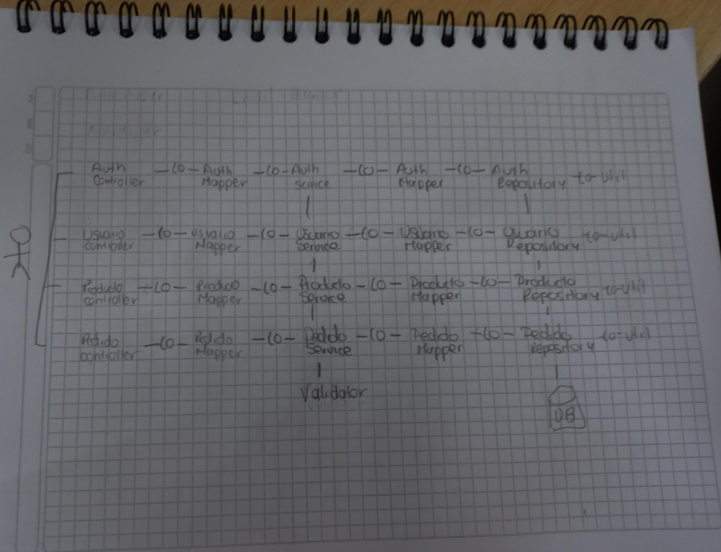
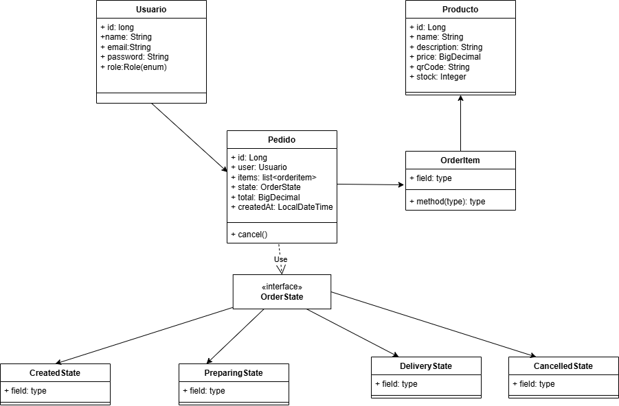
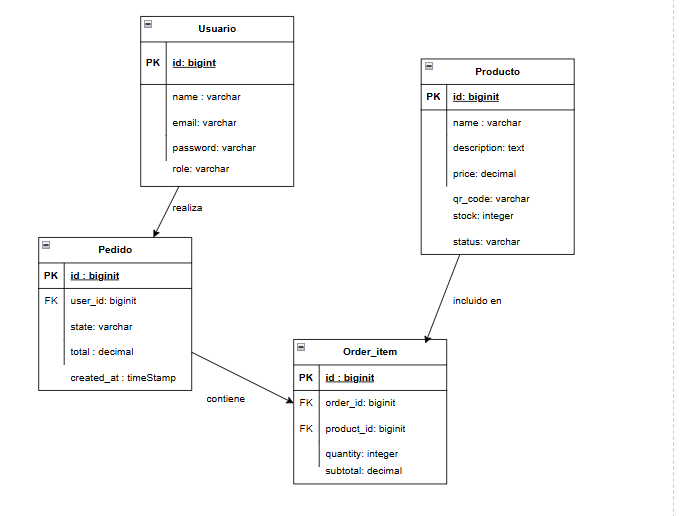

# DOSW_ParcialT2_ZharikMahecha


| Campo     | Detalle                        |
|-----------|--------------------------------|
| **Nombre** | Zharik Mahecha y Mariana Parra |
| **Grupo** | Grupo 1                        |


---

##  Tecnologías del proyecto

- Java 21
- Spring Boot 3.2.4
- PostgreSQL + JPA
- MongoDB
- Spring Security + JWT
- Lombok + MapStruct
- Swagger (SpringDoc OpenAPI)
- JUnit 5 + Mockito
- JaCoCo
- SonarQube
- SLF4J

---


# Parte Teorica

### Punto 1 -Funcionalidades
[Funcionalidades_punto1_.docx](docs/requeriments/Funcionalidades_punto1_.docx)


### Punto 2 - Diferencia entre diferencia entre Validaciones de input y Validaciones de negocio

- Validaciones de input: Verifica que los datos tenga el formato correcto


- Validaciones de negocio: Verifica que tengan sentido segun las reglas del sistema


### Punto 3 - Diferencia entre autenticación, autorización e integridad

-Autentificacion: es la forma en que el sistema valida la identificacion del usuario que intenta acceder

-Autorizacion:  Es la definicion de que puede hacer el usuario dentro del sistemas, los permisos que se le otorgan

-Integridad: Es la garantizacion de que la informacion no sera modificada ni alterada durante el proceso de almacenamiento

---
### Punto 4 - Diagrama de componentes general ECIEXPRESS 


El usuario usa la plataforma mediante la interfaz, usando el qr, luego esta hace las peticiones a todo el sistema interno,
el cual va almacenando la informacion dentro de la BD, este mismo devuelve la interaccion al fronted y retornara la 
informacion que usuario haya pedido

---

### Punto 5 - Problemas al no separar capas correctamente

- Sino se separa las capas se va a producir un mayor nivel de acoplamiento, se va a complicar la parte de las pruebas y 
al solucionar errores van a afectar a otras partes del sistema, que no deberian afectarse, es decir que no se implementa
un clean coding.

---

### punto 6 - Diagrama de Componentes especifico


### Punto 7 - diferencias entre un validador, una utilidad y un servicio

- Validador: Se hacen loas verificaciones del cumplimiento de las reglas de negocio
- Utilidad : Se especifican las operaciones que son comunes para simplificar el codigo
- Servicio: Se manejan las reglas complejas y la logica del negocio

---

### Punto 8 - Diagrama de clases


-  ¿Qué patrón de
   software usaría para manejar los estados del pedido y por qué? 
- Se usa el patrón State porque el comportamiento del Pedido cambia según su estado(tiene 4 estados y cada uno tiene distintas reglas). En lugar de llenar el codigo de condicionales, cada estado encapsula su propia logica, asi tenemos el codigo limpio

### Punto 9 - Diagrama entidad-relacion


### Punto 11 -

### Punto 12 - Explique cómo las pruebas garantizan el cumplimiento de las reglas de negocio y la integridad del sistema.

Ya que son usadas para evaluar un producto, garantizan las reglas de negocio y el cumplimiento de la integridad del 
sistema porque permiten identificar defectos en la arquitectura, funcionalidades no validas y vulnerabilidades 

---


### Punto 13 - Etapas principales de un pipeline y en qué consiste cada una

- Las etapas principales de un pipeline son:
  - Build: Instala las dependenciasm complila el codigo y lo empaqueta
  - Test: Automatiza las pruebas para avlidar cads commit
  - Analisis: Hace un analisi estatico y de seguridad
  - Deploy: Hace el despliegue a los entornos que se establezcan y usa contenedores 
  - Monitoring: Monitorea y alerta automaticamente si algo falla

---
### Punto 14 - ¿Qué sucede si una prueba falla en el pipeline? ¿Debe permitirse el despliegue? Justifique
- No se debe permitir el despliegue, ya que la intencion es que no se permita llevar errores a otra etapa de produccion


### Punto 15 - Explique el concepto de logging en el manejo de errores:

- Es el registro de los eventos que ocurren en la aplicacion como  los errores, las advertencias, es decir el manejo de
la observabilidad

a. ¿Qué información debería registrarse?
  - Mensaje de error claro
  - Niveles de error
  - id de usuario
  - Endpoint o modulo donde ocurre el evento

b. ¿Qué NO debería registrarse (por seguridad)?

  - Datos personales sensibles
  - Contraseñas 
  - Tokens

---
### Diseño de Interfaces — Figma

---

## 
## 
```

Swagger UI disponible en: [http://localhost:8080/swagger-ui.html](http://localhost:8080/swagger-ui.html)