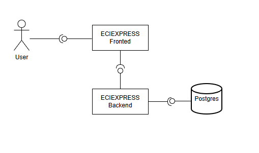

# DOSW_ParcialT2_ZharikMahecha


| Campo         | Detalle             |
|---------------|---------------------|
| **Nombre**    | Zharik Mahecha      |
| **Grupo**     | Grupo 1             |


---

##  Tecnologías del proyecto

- Java 17
- Spring Boot 3.2.4
- PostgreSQL + JPA
- MongoDB
- Spring Security + JWT
- Lombok + MapStruct
- Swagger (SpringDoc OpenAPI)
- JUnit 5 + Mockito
- JaCoCo
- SonarQube
- SLF4J

---


# Parte Teorica

### Punto 3 - Dieferencia entre autenticación, autorización e integridad

-Autentificacion: es la forma en que el sistema valida la identificacion del usuario que intenta acceder

-Autorizacion:  Es la definicion de que puede hacer el usuario dentro del sistemas, los permisos que se le otorgan

-Integridad: Es la garantizacion de que la informacion no sera modificada ni alterada durante el proceso de almacenamiento

---
### Punto4 - Diagrama de componentes general ECIEXPRESS 



El usuario usa la plataforma mediante la interfaz, usando el qr, luego esta hace las peticiones a todo el sistema interno,
el cual va almacenando la informacion dentro de la BD, este mismo devuelve la interaccion al fronted y retornara la 
informacion que usuario haya pedido

---

### Punto 5 - Problemas al no separar capas correctamente

- Sino se separa las capas se va a producir un mayor nivel de acoplamiento, se va a complicar la parte de las pruebas y 
al solucionar errores van a afectar a otras partes del sistema, que no deberian afectarse, es decir que no se implementa
un clean coding.

---

### Punto 7 - diferencias entre un validador, una utilidad y un servicio

- Validador: Se hacen loas verificaciones del cumplimiento de las reglas de negocio
- Utilidad : Se especifican las operaciones que son comunes para simplificar el codigo
- Servicio: Se manejan las reglas complejas y la logica del negocio

---

### Diseño de Interfaces — Figma

---

## 
## 
```

Swagger UI disponible en: [http://localhost:8080/swagger-ui.html](http://localhost:8080/swagger-ui.html)